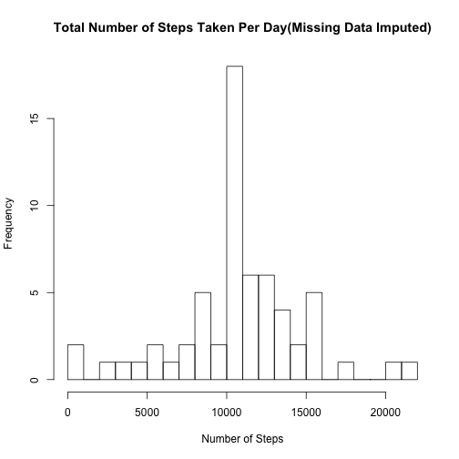

# Reproducible Research: Peer Assessment 1

## 1. Loading and preprocessing the data

### 1.1 Loading the raw data to dataset "raw_data".


```r
raw_data <- read.csv("activity.csv")

str(raw_data)
```

```
## 'data.frame':	17568 obs. of  3 variables:
##  $ steps   : int  NA NA NA NA NA NA NA NA NA NA ...
##  $ date    : Factor w/ 61 levels "2012-10-01","2012-10-02",..: 1 1 1 1 1 1 1 1 1 1 ...
##  $ interval: int  0 5 10 15 20 25 30 35 40 45 ...
```

### 1.2 Removing all missing values and producing a new dataset "proc_data".


```r
proc_data <- raw_data[!is.na(raw_data$steps),]

str(proc_data)
```

```
## 'data.frame':	15264 obs. of  3 variables:
##  $ steps   : int  0 0 0 0 0 0 0 0 0 0 ...
##  $ date    : Factor w/ 61 levels "2012-10-01","2012-10-02",..: 2 2 2 2 2 2 2 2 2 2 ...
##  $ interval: int  0 5 10 15 20 25 30 35 40 45 ...
```

## 2. What is mean total number of steps taken per day?

### 2.1 Plot histogram of the total number of steps taken each day.
#### 2.1.1 Calculate the sum of total number of steps taken per day.

```r
total_steps_eachday <- aggregate(proc_data[,1],list(proc_data$date),sum)

head(total_steps_eachday)
```

```
##      Group.1     x
## 1 2012-10-02   126
## 2 2012-10-03 11352
## 3 2012-10-04 12116
## 4 2012-10-05 13294
## 5 2012-10-06 15420
## 6 2012-10-07 11015
```

#### 2.1.2 Plot the histogram. 

```r
hist(total_steps_eachday$x,breaks = 22, xlab="Number of Steps", 
     main="Total Number of Steps Taken Per Day")
```

 

### 2.2 Calculate and report the mean and median total number of steps taken per day.

#### The mean total number of steps taken per day:

```r
mean(total_steps_eachday$x)
```

```
## [1] 10766.19
```

#### The median total number of steps taken per day:

```r
median(total_steps_eachday$x)
```

```
## [1] 10765
```
## 3. What is the average daily activity pattern?

### 3.1 Plot time series figure of the 5-minute interval and the average number of steps taken, averaged across all days.

#### 3.1.1 Calculate the average steps for 5-min interval across all days.

```r
average_steps<-aggregate(proc_data[,1],list(proc_data$interval),mean)

head(average_steps)
```

```
##   Group.1         x
## 1       0 1.7169811
## 2       5 0.3396226
## 3      10 0.1320755
## 4      15 0.1509434
## 5      20 0.0754717
## 6      25 2.0943396
```

#### 3.1.2 Plot the time series figure.

```r
plot(x = average_steps$Group.1,y = average_steps$x, type = "l", xlab = "Interval", 
     ylab = "Number of Steps" , main = "Average Daily Activity Pattern")
```

 

### 3.2 Which 5-minute interval, on average across all the days in the dataset,contains the maximum number of steps?


```r
average_steps[average_steps$x == max(average_steps$x),1]
```

```
## [1] 835
```

## 4. Imputing missing values
### 4.1 Calculate the total number of missing values in the dataset(i.e. the total number of rows with NAs).

```r
sum(is.na(raw_data$steps))
```

```
## [1] 2304
```

### 4.2 Using the mean for that 5-minute interval to fill in all of the missing values in the original dataset and producing a new dataset "proc_data_imputed" with the missing data filled in.

```r
proc_data_imputed <- raw_data

for(imputing_date in unique(proc_data_imputed[is.na(proc_data_imputed$steps), ]$date)){
    proc_data_imputed[proc_data_imputed$date == imputing_date,1] <- average_steps$x 
    }

str(proc_data_imputed)
```

```
## 'data.frame':	17568 obs. of  3 variables:
##  $ steps   : num  1.717 0.3396 0.1321 0.1509 0.0755 ...
##  $ date    : Factor w/ 61 levels "2012-10-01","2012-10-02",..: 1 1 1 1 1 1 1 1 1 1 ...
##  $ interval: int  0 5 10 15 20 25 30 35 40 45 ...
```

### 4.3 Make a histogram of the total number of steps taken each day and Calculate and report the mean and median total number of steps taken per day. Do these values differ from the estimates from the first part of the assignment? What is the impact of imputing missing data on the estimates of the total daily number of steps?

#### 4.3.1 Recalculate the total number of steps taken per day with imputed values.


```r
total_steps_eachday_imputed <- aggregate(proc_data_imputed[,1],list(proc_data_imputed$date),sum)

head(total_steps_eachday_imputed)
```

```
##      Group.1        x
## 1 2012-10-01 10766.19
## 2 2012-10-02   126.00
## 3 2012-10-03 11352.00
## 4 2012-10-04 12116.00
## 5 2012-10-05 13294.00
## 6 2012-10-06 15420.00
```

#### 4.3.2 Plot the histogram with imputed values.


```r
hist(total_steps_eachday_imputed$x,breaks = 22, xlab="Number of Steps",
     main="Total Number of Steps Taken Per Day(Missing Data Imputed)")
```

 

#### 4.3.3 Recalculate the mean and median total number of steps taken per day with imputed values.

#### The mean total number of steps taken per day:

```r
mean(total_steps_eachday_imputed$x)
```

```
## [1] 10766.19
```


#### The median total number of steps taken per day:

```r
median(total_steps_eachday_imputed$x)
```

```
## [1] 10766.19
```

#### Comparing the mean and median with imputed values and without imputed values

```r
mean(total_steps_eachday_imputed$x) - mean(total_steps_eachday$x)
```

```
## [1] 0
```

```r
median(total_steps_eachday_imputed$x) - median(total_steps_eachday$x)
```

```
## [1] 1.188679
```

#### Conclusion: The comparison results show that the mean keeps unchanged but the median become slightly larger after the missing values been imputed. In my view, the impact of imputing missing data on the estimates of the total daily number of steps is small because the total number of missing values is only 2304, approx. 13% of 17568, total number of values, which may be ignored in data analysis on this case.


## 5. Are there differences in activity patterns between weekdays and weekends?

### 5.1 Create a new factor variable in the dataset "proc_data_imputed" with two levels – “weekday” and “weekend” indicating whether a given date is a weekday or weekend day


```r
Sys.setlocale("LC_TIME", "en_US.UTF-8") 
```

```
## [1] "en_US.UTF-8"
```

```r
proc_data_imputed <- cbind(proc_data_imputed, week = rep("weekday", nrow(proc_data_imputed)))

proc_data_imputed$week <- as.character(proc_data_imputed$week)

for(i in 1:nrow(proc_data_imputed)){ 
    if( weekdays(as.Date(proc_data_imputed$date[i])) %in% c("Saturday","Sunday") ){ 
        proc_data_imputed$week[i] <- "weekend" 
        } 
      }

proc_data_imputed$week <- as.factor(proc_data_imputed$week)

str(proc_data_imputed)
```

```
## 'data.frame':	17568 obs. of  4 variables:
##  $ steps   : num  1.717 0.3396 0.1321 0.1509 0.0755 ...
##  $ date    : Factor w/ 61 levels "2012-10-01","2012-10-02",..: 1 1 1 1 1 1 1 1 1 1 ...
##  $ interval: int  0 5 10 15 20 25 30 35 40 45 ...
##  $ week    : Factor w/ 2 levels "weekday","weekend": 1 1 1 1 1 1 1 1 1 1 ...
```

### 5.2 Make a panel plot containing a time series plot (i.e. type = "l") of the 5-minute interval (x-axis) and the average number of steps taken, averaged across all weekday days or weekend days (y-axis).


```r
average_steps_weekday_weekend <- 
    aggregate(proc_data_imputed[,1], list(proc_data_imputed$interval, proc_data_imputed$week), mean)

library(lattice)

xyplot(x~Group.1|Group.2, data = average_steps_weekday_weekend, type ="l", 
       xlab = "Interval", ylab = "Number of Steps" , 
       main = "Average Daily Activity Pattern", layout = c(1,2))
```

 
